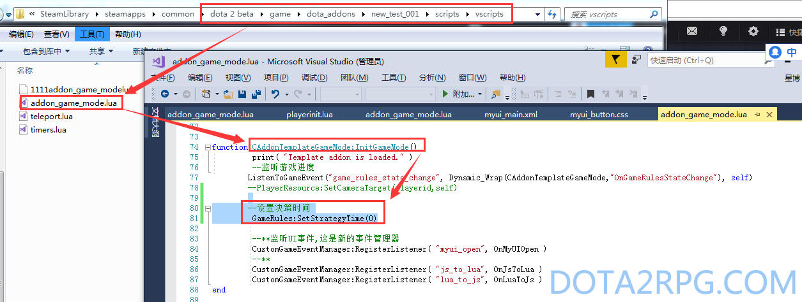

# 游戏时间设置

*更新时间：2019-02-03*


```
	-- 设置选择英雄时间
	GameRules:SetHeroSelectionTime(60)

	-- 设置决策时间
	GameRules:SetStrategyTime(20)

	-- 设置展示时间
	GameRules:SetShowcaseTime(5)

	--设置游戏准备时间
	GameRules:SetPreGameTime(30)

```

设置时间需要在 `CAddonTemplateGameMode:InitGameMode()` 函数里进行，如下：




## 参考

- [https://developer.valvesoftware. ... /API#DOTA_GameState](https://developer.valvesoftware.com/wiki/Dota_2_Workshop_Tools/Scripting/API#DOTA_GameState)
- [游戏时间设置]设置决策时间选择英雄时间展示时间游戏准备时间为0
  http://www.dota2rpg.com/forum.php?mod=viewthread&tid=4190&fromuid=13631
  (出处: 中国DOTA2 RPG DOTA2地图门户 - 阿哈利姆魔法隐修议会(AMHC))