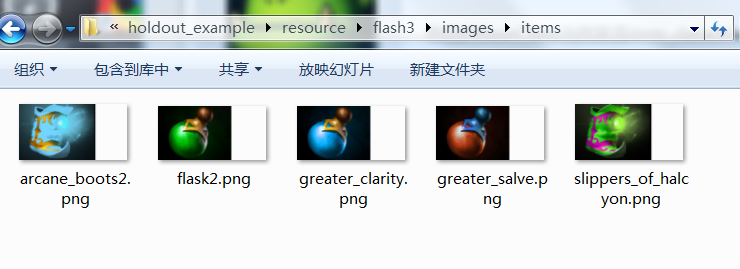

# 物品的制作


## 1. 定义物品

自定义物品需要在 `npc_items_custom.txt` 里面制作

自定义物品的名称，必须以 `item_` 作为前缀

自定义物品的 `ID` 不能与其它物品的 `ID` 重复

File：`<MAP>/scripts/npc/npc_items_custom.txt`

```
"DOTAAbilities"
{
    "item_my_broadsword"
    {
        "ID"                            "1000"
        "BaseClass"                     "item_datadriven"
        "AbilityBehavior"               "DOTA_ABILITY_BEHAVIOR_PASSIVE"
        // icon
        "AbilityTextureName"            "item_my_broadsword" 				

        "ItemCost"						"100"
        "ItemDroppable"                 "1"
        "ItemSellable"                  "1"
        "ItemPurchasable"               "1"
        "ItemKillable"                  "1"
        "ItemQuality"                   "rare"
        "ItemShareability"              "ITEM_FULLY_SHAREABLE"
    }
}
```


## 2. 自定义物品的图标

命名：自定义物品的名称为 `item_my_broadsword`，那图标的名称必须为 `my_broadsword.png`

格式：`png`

尺寸：128 x 64

位置：`<MAP>/resource/flash3/images/items` 

**注意**：图标的右边一部分必须为透明（40像素），所有真实的图标尺寸是 88 x 64

例子：




## 3. 给商店添加物品

首先在 `<MAP>/scripts` 目录下，建立一个名为 `shops` 的文件夹。

然后建立一个 `txt` 文件，名称为 `<YOUR_MAP_NAME>_shops.txt`；

文件的名称必须与地图的名字对应，还需要后缀  `_shops`；

如：`template_map.vmap` 地图，那名称就是 `template_map_shops.txt`。

File: `<MAP>/scripts/shops/template_map_shops.txt`

```
"dota_shops"
{
        "consumables"  //消耗品
        {
            "item"                "item_my_broadsword"
        }

        "attributes"  //属性物品
        {
            "item"                "item_my_broadsword"
        }

        "weapons_armor"
        {
        }
                        
        "misc"
        {
        }        
        
        // Level 1 - Green Recipes
        "basics"
        {
        }

        // Level 2 - Blue Recipes
        "support"
        {
        }
                                
        "magics"                        
        {
        }
                
        // Level 3 - Purple Recipes        
        "defense"
        {
        }
                        
        "weapons"
        {
        }
                
        // Level 4 - Orange / Orb / Artifacts                                
        "artifacts" 
        {        
        }

        "sideshop1"  //路边商店1
        {
        }

        "sideshop2"  //路边商店2
        {
        }
        
        "secretshop"  //神秘商店
        {                                                        
                "item"        "item_my_broadsword"
        }        
}

```


## 物品技能


## 物品的合成


下面是两个新物品的代码：

```
"item_my_knife"
{
        "ID"                            "1001"
        "BaseClass"                     "item_datadriven"
        "AbilityBehavior"               "DOTA_ABILITY_BEHAVIOR_PASSIVE"
        "AbilityTextureName"        	"item_my_knife"

        "ItemCost"                      "200"
        "ItemDroppable"                 "1"
        "ItemSellable"                  "1"
        "ItemPurchasable"               "1"
        "ItemKillable"                  "1"
        "ItemQuality"                   "rare"
        "ItemShareability"              "ITEM_FULLY_SHAREABLE"
}

"item_golded_sword"
{
        "ID"                            "1002"
        "BaseClass"                     "item_datadriven"
        "AbilityBehavior"               "DOTA_ABILITY_BEHAVIOR_PASSIVE"
        "AbilityTextureName"        	"item_golded_sword"

        "ItemCost"              		"99999"
        "ItemDroppable"    				"1"
        "ItemSellable"            		"1"
        "ItemPurchasable"               "1"
        "ItemKillable"        			"1"
        "ItemQuality"             		"rare"
        "ItemShareability"              "ITEM_FULLY_SHAREABLE"
}

```

合成物品：`item_golded_sword` = `item_my_broadsword` +`item_my_knife`

合成物品的价格 = 合成所需物品价格之和 + 合成符的价格 （系统会自动的修改成合成物品的价格）

Dota2的物品合成系统是通过合成符来实现的，所有需要定义一个**合成符**。

合成符代码：

```
"item_recipe_golded_sword"
{
        "ID"                     	"1003"
        "BaseClass"       			"item_recipe_arcane_boots"
        "ItemCost"            		"50"        
        "ItemShopTags"              ""

        ItemRecipe                 	"1" 
        ItemResult                  "item_golded_sword"
        ItemRequirements   
        {
        	"01"    				"item_my_broadsword;item_my_knife"
        }
}

```

名称：`item_recipe_<加上要合成物品的名称>`，合成物品的名称没有 `item_` 前缀

属性：

​	`ID`	合成符也是要有自己的ID，不能重复

​	`BaseClass`  是 `item_recipe_arcane_boots`，只要是合成符就用这个类

​	`ItemCost`  如果合成符的价格为*0*，那么只要有这两个装备就会自动合成

​	`ItemResult`  填写要合成的物品

​	`ItemRequirements`  填写物品的合成公式；如果还有其他合成方法，只需要在 `01` 下面加入 `02` 合成公式


## 可选：给英雄推荐物品

需要在 `<MAP>/itembuilds` 目录下给指定的英雄编写 `txt`文件。

如果是斧王，那文件的名称 `default_axe.txt` ; 如果是剑圣，那文件的名称就是 `default_juggernaut.txt` 。

File: `<MAP>/itembuilds/default_axe.txt`

```
"itembuilds"
{
        "author"               "Valve"
        "hero"                 "npc_dota_hero_axe"
        "Title"                "Recommended items for Axe"
        
        "Items"
        {                
                "#DOTA_Item_Build_Starting_Items" //出门装备
                {
                        "item"                "item_my_broadsword"
                }
                
                "#DOTA_Item_Build_Early_Game" //前期装备
                {        
                }
                
                "#DOTA_Item_Build_Core_Items" //核心装备
                {
                }
                
                "#DOTA_Item_Build_Luxury" //可选装备
                {
                }
        }
}

```


## 物品基础属性

| ItemCost      | 金钱       |
| ------------- | ---------- |
| ItemDroppable | 是否可丢弃 |
| ItemSellable  | 是否可出售 |

| ItemPurchasable     | 是否可购买           |
| ------------------- | -------------------- |
| ItemKillable        | 是否能够攻击         |
| ItemAlertable       | 是否可提醒           |
| ItemPermanent       | 是否永久的           |
| ItemInitialCharges  | 是否初始物品数量     |
| ItemRequiresCharges | 是否有数量才可用     |
| SideShop            | 是否在旁边的商店出售 |
| SecretShop          | 是否在神秘商店出售   |
| ItemCastOnPickup    | 是否拾起就使用       |
| ItemStackable       | 是否可叠加           |
| ItemQuality         | 品质                 |
| ItemShopTags        | 店铺标签             |
| ItemAliases         | 别名                 |
| MaxUpgradeLevel     | 物品最大等级         |
| ItemBaseLevel       | 物品当前等级         |
| ItemRecipe          | 是否是物品合成菜单   |
| ItemResult          | 合成的物品           |
| ItemRequirements    | 合成所需物品         |


**ItemQuality //品质，测试结果中是影响装备名字的颜色**

| component   | 这个翻译不出来，零件？部件？ |
| ----------- | ---------------------------- |
| rare        | 稀有[蓝]                     |
| epic        | 史诗[紫]                     |
| common      | 常见[绿]                     |
| consumable  | 消耗品[白]                   |
| secret_shop | 神秘商店[青蓝]               |
| artifact    | 神器[橙]                     |


**ItemDeclarations    //购买提示方式**

| DECLARE_PURCHASES_IN_SPEECH     | 语音 |
| ------------------------------- | ---- |
| DECLARE_PURCHASES_TO_SPECTATORS | 观众 |
| DECLARE_PURCHASES_TO_TEAMMATES  | 队友 |


**ItemDisassembleRule    //是否可拆分**

| DOTA_ITEM_DISASSEMBLE_ALWAYS | 总是可以 |
| ---------------------------- | -------- |
| DOTA_ITEM_DISASSEMBLE_NEVER  | 不可拆分 |


**ItemShareability**    **//共享方式**

| ITEM_FULLY_SHAREABLE          | 都可以共享 |
| ----------------------------- | ---------- |
| ITEM_FULLY_SHAREABLE_STACKING | 库存共享   |
| ITEM_NOT_SHAREABLE            | 不可共享   |
| ITEM_PARTIALLY_SHAREABLE      | 部分共享   |


## 参考

- 5.0 Dota2物品教程
  http://www.dota2rpg.com/forum.php?mod=viewthread&tid=1228&fromuid=13631
  (出处: 中国DOTA2 RPG DOTA2地图门户 - 阿哈利姆魔法隐修议会(AMHC))